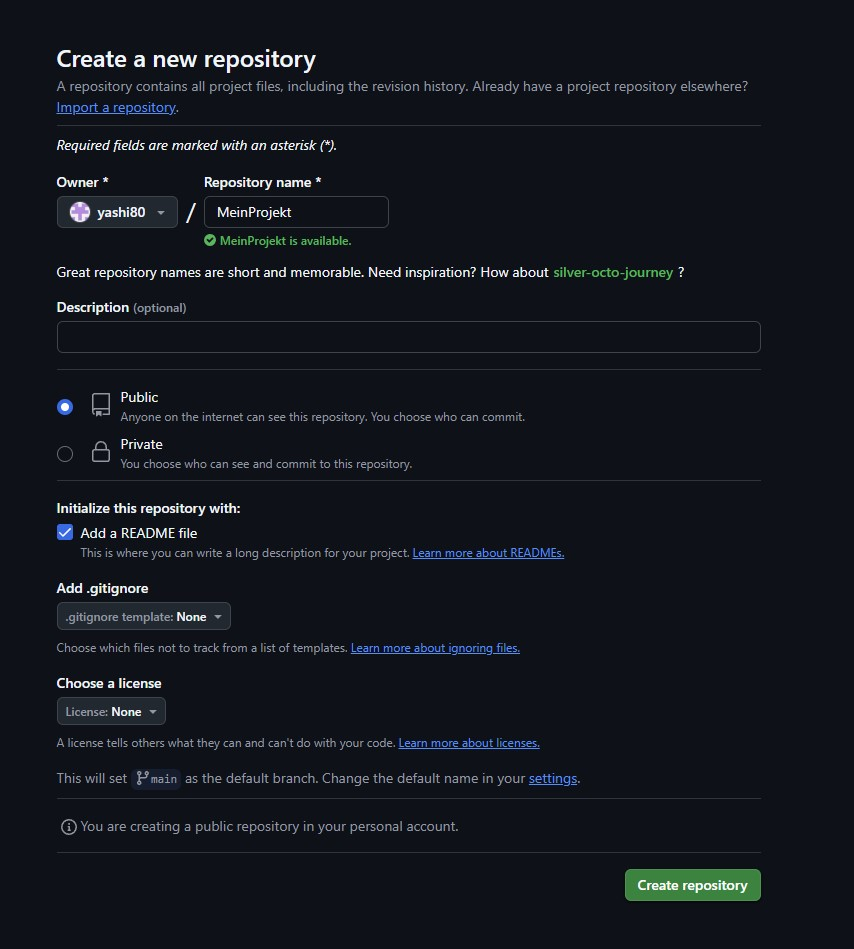
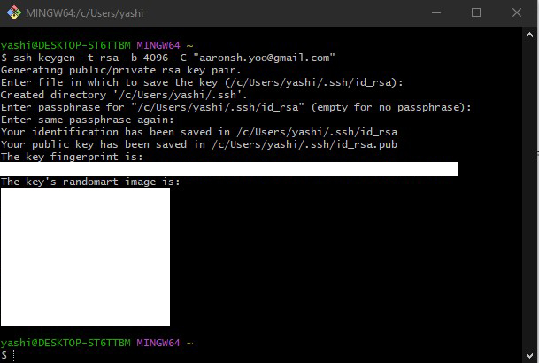
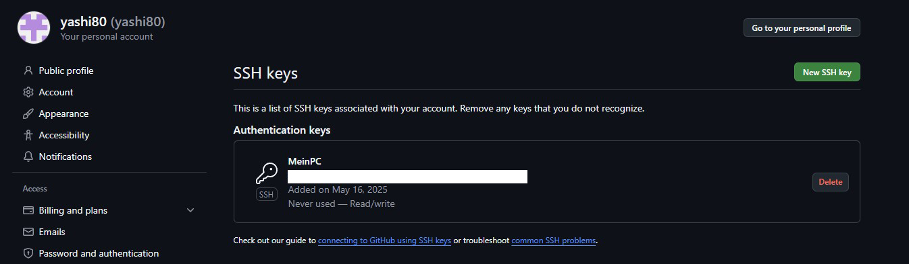
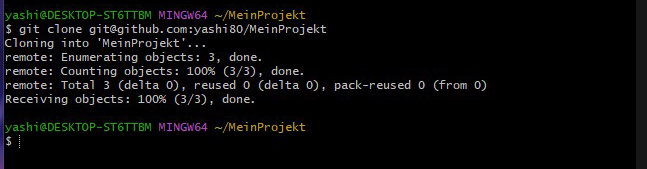
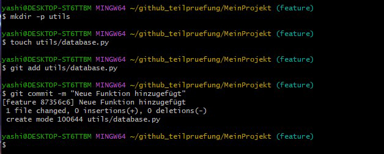
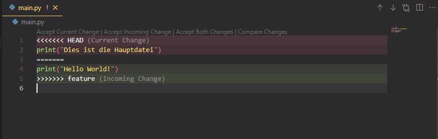
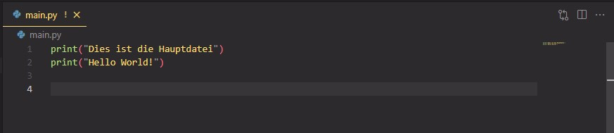
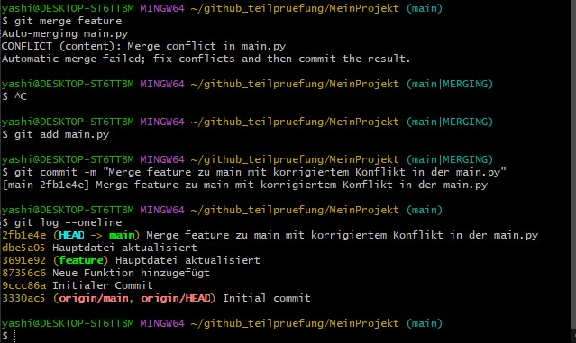

# MeinProjekt

# Schritte zum Erstellen des Repository.

1. Zunächst einmal geht man auf github.com und meldet sich dort mit seinem Benutzerkonto an. Falls noch kein Konto vorhanden ist, dann kostenlos registrieren.

2. Nach dem Login klicht man auf "+ New" (oben rechts) und erstellt ein neues leeres Repository mit dem Namen "MeinProjekt"

# Schritte zum Erstellen des ssh Keys.

1. Zunächst einmal über das Terminal oder Git Bash überprüfen, ob bereits ein SSH-Key existiert :

`ls ~/.ssh/`

2. Wenn kein SSH-Key existiert, dann über folgenden Befehl einen erstellen:

   `ssh-keygen -t rsa -b 4096 -C "aaronsh.yoo@gmail.com"`

   Optional kann der Speicherort und das Passwort gesetzt werden.

3. Bevor das Repository geklont werden kann, muss zunächst sichergestellt werden, dass der SSH Key bei Github hinterlegt ist. Dafür zeigt man sich mit folgendem Befehl den öffentlichen Schlüssel an :

`cat ~/.ssh/id_rsa.pub`

Der Schlüssel beginnt mit "ssh-sra..."; diesen kopieren und den kompletten Text in den GitHub Einstellungen unter SSH Keys hinzufügen via "Add SSH key".

# Schritte zum lokalen Klonen des Repositorys, zum Konfigurieren von Git und zum Erstellen der initialen Commits

1. Zunächst über das Terminal oder Git Bash zu dem Verzeichnis wechseln, wo das lokale Git-Repository erstellt werden soll.

2. Anschließend das GitHub-Repository "MeinProjekt" mit folgendem Befehl clonen:

`git clone git@github.com:yashi80/MeinProjekt.git`

3.  Navigiere in das geklonte Verzeichnis "MeinProjekt" mit dem Befehl\_

`cd MeinProjekt`

4. Konfiguration mit Eingabe von Name und E-Mail :

`git config user.name "Aaron Yoo"`

`git config user.email "aaronsh.yoo@gmail.com"`

4. Füge eine neue Datei hinzu (z.B. "main.py") mit folgendem Befehl:

`echo > main.py`

Anschließend neue Datei hinzufügen und den initialen Commit erstellen mit :

`git add main.py`  
`git commit -m "Initialer Commit"`

# Schritte zum Erstellen des "feature"-Branches, zum Hinzufügen einer neuen Datei zu diesem Branch und zum Committen der Änderungen

1. Neuen Branch mit Namen "feature" erstellen und zum neuen Branch wechseln mit :

`git checkout -b feature`

2. Neue Datei hinzufügen (z.B. "utils/database.py") und einen commit auf dem "feature"-Branch erstellen:

`mkdir -p utils`  
`touch utils/database.py`  
`git add utils/database.py`  
`git commit -m "Neue Funktion hinzugefügt"  `

3. Bearbeite die Datei "main.py" und führe einen Commit auf dem "feature"-Branch durch:

`echo 'print("Hello, world!")' > main.py`  
`git add main.py`  
`git commit -m "Hauptdatei aktualisiert"  `

# Schritte zum Mergen des "feature"-Branches in den "master(main)"-Branch und zum Beheben des dabei auftretenden Merge-Konflikts

1. Zunächst wechselt man zurück zum "master"-Branch mit :

`git checkout main`

2. Anschließend bearbeitet man die Datei "main.py" und führt einen Commit auf dem "master"-Branch durch :

`echo 'print("Dies ist die Hauptdatei")' >> main.py`  
`git add main.py`  
`git commit -m "Hauptdatei aktualisiert"`

3. Beim Versuch den "feature"-Branch mit "git merge feature" in den "main"-Branch zu mergen verursacht einen Merge Konflikt:

`CONFLICT (content): Merge conflict in main.py
Automatic merge failed; fix conflicts and then commit the result.`

Dieser Merge Konflikt kommt zustande, weil im "main"-Branch und im "feature"-Branch Änderungen an der main.py vorgenommen wurde und Git nicht automatisch entscheiden kann, welche behalten werden soll.

4. Man muss daher den Konflikt folgendermaßen manuell lösen:

Zunächst öffnet man mit einem Editor seiner Wahl die Datei und sieht dort dann folgendes:

Man muss daher die Konfliktmarkierungen (<<<<<<<, =======, >>>>>>>) entfernen und den Code sinnvoll kombinieren:

Diese Datei dann abspeichern und Änderung zum Commit vormerken:

`git add main.py`

Den Merge dann abschließen mit :

`git commit -m "Merge feature zu main mit korrigiertem Konflikt in der main.py"`

Mit folgendem Befehl kann man dann überprüfen, der der Merge korrekt abgeschlossen wurde:

`git log --oneline`

